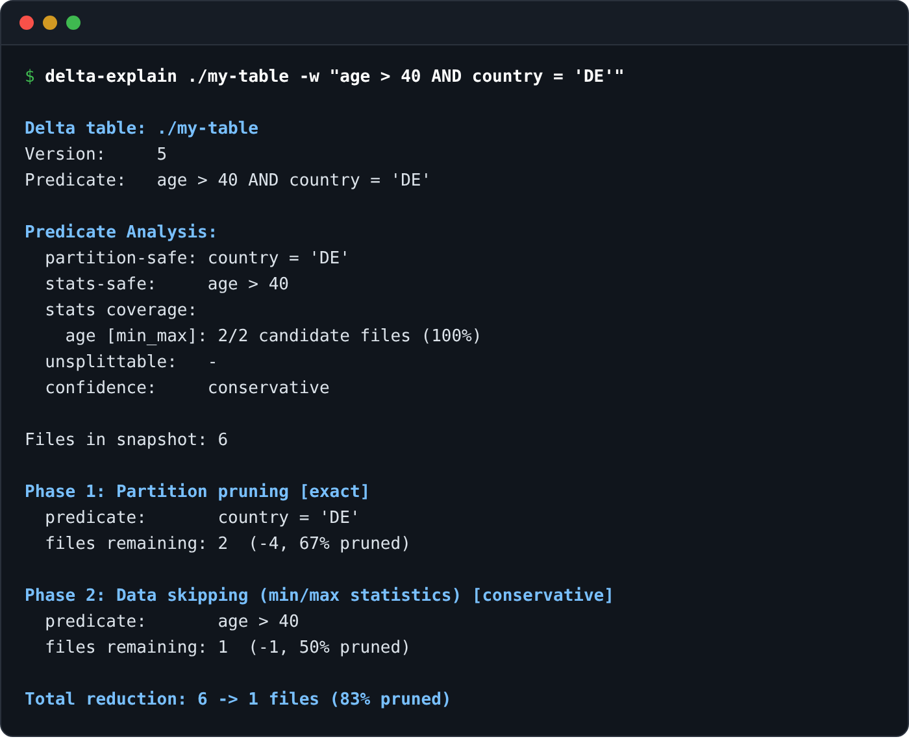
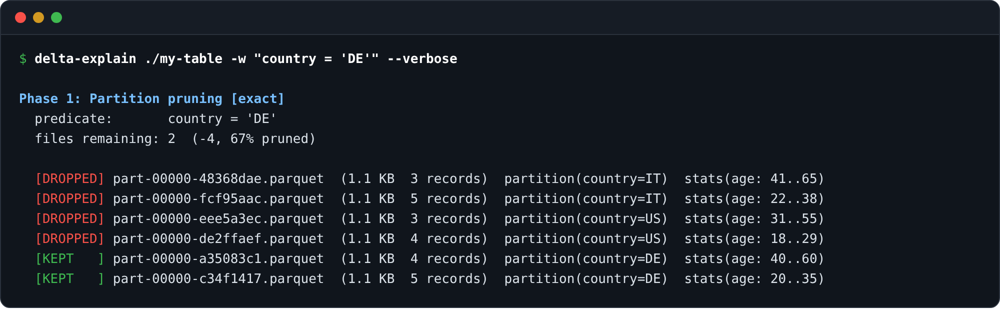

# delta-explain

[](https://crates.io/crates/delta-explain)
[](https://pypi.org/project/delta-explain/)
[](https://github.com/cdelmonte-zg/delta-explain/actions/workflows/ci.yml)
[](LICENSE)

**Make Delta pruning visible.** delta-explain shows how partition
pruning and data skipping narrow the set of candidate files in a
Delta table.

Use it from the shell, through its versioned JSON contract and Python
API, or in CI as a threshold-based guardrail. Point it at a local Delta
table or an `s3://`, `az://`, or `gs://` location.

delta-explain is strictly read-only: it reads Delta transaction-log
metadata, not table rows, and performs no writes, locks, or telemetry.
This keeps its data-access surface small. Its guarantees are documented
in [docs/semantics.md](docs/semantics.md).

**Documentation**: [cdelmonte-zg.github.io/delta-explain](https://cdelmonte-zg.github.io/delta-explain/)

## Install

Choose one:

```bash
brew tap cdelmonte-zg/tap && brew install delta-explain    # Homebrew (macOS, Linux)
pip install delta-explain                                  # PyPI: binary wheel + Python API
cargo install delta-explain                                # crates.io (Rust 1.88+)
docker pull ghcr.io/cdelmonte-zg/delta-explain             # Docker (amd64 + arm64)
```

Every other route - pre-built binaries and `.deb` packages for six targets, Scoop, from Git - is on the [install page](https://cdelmonte-zg.github.io/delta-explain/getting-started/install.html).

## Usage

The three ways in: the shell, Python, CI.

### From the shell

```bash
delta-explain ./my-table -w "age > 40 AND country = 'DE'"
```

 1 files (83% pruned)" width="700">

With `--verbose`, the per-file view - which files were kept or dropped, and why:



Cloud tables authenticate through the provider's ambient credential chain, environment variables (`--env-creds`), AWS profiles (`--profile`), or explicit `--option` pairs; the per-provider recipes are in the [cloud storage guide](https://cdelmonte-zg.github.io/delta-explain/guides/cloud.html). The full flag list is `delta-explain --help`, or the [CLI reference](https://cdelmonte-zg.github.io/delta-explain/reference/cli.html). Predicates are standard SQL WHERE syntax; the supported constructs, with what each one can prune, are in the [predicate syntax reference](https://cdelmonte-zg.github.io/delta-explain/reference/predicate-syntax.html).

### From Python

The PyPI wheel ships the compiled binary (the `delta-explain` command works from the same environment) plus a thin Python API around the JSON contract:

```python
from delta_explain import explain

report = explain("s3://warehouse/events",
                 where="country = 'DE' AND age > 40",
                 min_pruning=80, env_creds=True)
report.passed              # gate outcome; False means the CLI would exit 1
report.total_pruning_pct
```

Gate failures come back as a report with `passed == False`; runtime errors raise `DeltaExplainError` with the CLI's message: the same exit-code contract as the command line, in Python types. More in the [Python guide](https://cdelmonte-zg.github.io/delta-explain/guides/python.html).

### In CI, as a gate

`--min-pruning <PCT>` fails the run (exit 1) when total pruning falls below the threshold; `--assert-stats` fails it when any file in the snapshot is missing statistics:

```bash
delta-explain s3://warehouse/events -w "date = '2024-01-15'" --min-pruning 90 --assert-stats
```

The repo doubles as a composite GitHub Action, so the gate is one step. Pin the tag: the action downloads a released binary, so the ref you pin is the behavior you get.

```yaml
- uses: cdelmonte-zg/delta-explain@v0.7.0
  with:
    table: s3://warehouse/events
    where: "country = 'DE' AND age > 40"
    min-pruning: "60"
    assert-stats: "true"
    env-creds: "true"
```

Inputs mirror the CLI flags; the step fails when a gate fails and exposes `pruning-pct`, `final-files`, and `result` as outputs for later steps. How to calibrate the threshold, keep the CI predicate semantically equivalent to the runtime query, and run the same gate from Docker: [gating pruning in CI](https://cdelmonte-zg.github.io/delta-explain/guides/ci-gating.html).

### Examples

Every example in [`examples/`](examples/) is executable and runs against real tables:

- [The three-minute quickstart](examples/quickstart/) - one script, five beats, each one thing delta-explain does.
- [Tuning a Delta table](examples/taxi-optimization/) - a notebook that uses delta-explain to measure four layouts of real NYC-taxi data, from unpartitioned pile to date partitions plus fare-sorted files.
- [S3-compatible storage (MinIO)](examples/minio-s3/) and [a real GCS bucket](examples/gcs/) - the same data pruning very differently depending on physical layout, on `s3://` and `gs://` tables.

## Performance

delta-explain reads only the Delta log, never the parquet data files, so its cost scales with the number of `add` actions, not with data volume. Measured at 200k files on Linux, local disk, in the three log shapes that matter (generate them yourself with `cargo run --release --example gen_scale_log`):

| Log shape (200k files) | Baseline | With predicate | Peak memory |
|---|---|---|---|
| single JSON commit | ~1.0 s | ~1.3 s | ~280 MB |
| 2000 JSON commits | ~1.4 s | ~2.2 s | ~320 MB |
| 2000 commits + parquet checkpoint | ~0.8 s | ~1.0 s | ~240 MB |

The most production-like shape (checkpointed) is also the fastest: the kernel reads one parquet checkpoint instead of replaying thousands of JSON commits. Scaling is linear at roughly 1.5 KB of resident memory per file, which extrapolates to ~1.5 GB at one million files; that is the current practical ceiling and it is a known limitation, not a hidden one. Predicate complexity is usually secondary to log size at this scale: an `IN` list with 500 items over 200k files adds about 0.4 s.

Data volume itself is invisible - what a big table costs is its log. A 10 TB profile (40k files x 256 MB, 31 stats columns, checkpointed; `--wide 30 --file-size-mb 256`) runs in ~1.5 s at ~470 MB; the pathological small-files version of the same 10 TB (160k files x 64 MB, same stats width) takes ~5 s at ~1.8 GB. Memory scales with files x stats leaves, so the one-million-file ceiling above assumes a narrow schema: wide production schemas reach it proportionally earlier, and `delta.dataSkippingNumIndexedCols` on the table bounds the width the log carries in the first place.

Output is the dimension to manage on large tables: the compact JSON stays summary-only at any size, and per-file detail (`--verbose`, in both formats) should be capped with `--limit`.

## The report viewer

Reports are also emitted as versioned JSON (`--format json`) under a formal, CI-enforced contract - [the schema](schemas/report-v0.5.schema.json) and [the field-by-field reference](docs/json-schema.md). Any saved report can be visualized as a self-contained HTML page - pruning funnel, analysis, per-file table - with [one drop or one command](viewer/README.md); attach it to a CI run so a failed gate shows *which* phase did not prune, not just an exit code:


## Deep dive

For a detailed walkthrough of the architecture, design decisions, and the reasoning behind the two-phase model, see the companion article: [delta-explain: Making Delta Lake Pruning Visible](https://cdelmonte.dev/projects/delta-explain-making-delta-pruning-visible/).

## Contributing

Build with `cargo build && cargo test`; the contributor guide - architecture, testing conventions, fixtures - is [DEVELOPMENT.md](DEVELOPMENT.md).

## License

MIT

## Author

[Christian Del Monte](https://github.com/cdelmonte-zg)

`delta-explain` is built on [delta-kernel-rs](https://github.com/delta-io/delta-kernel-rs) and focuses on making Delta-level file elimination visible.
